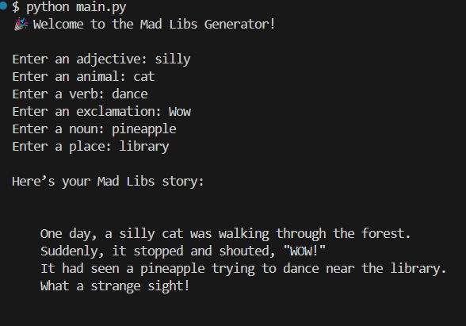

# Mad Libs Generator

Create a hilarious, random story based on user input using Python!

##  What It Does

Prompts the user for several words (like an adjective, noun, verb, etc.) and then inserts them into a funny story template.

## How to Run

Make sure you have Python 3 installed.

```bash
python main.py
```
## Example Output:


## Skills Used
- User input handling
- String formatting
- Simple CLI interactions