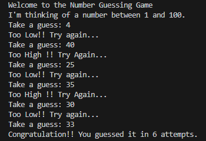

# Number Guessing Game

A simple CLI-based number guessing game where you try to guess a randomly generated number between 1 and 100.

##  How to Play

The program randomly selects a number between 1 and 100. You have to guess the number. The game will tell you if your guess is too high or too low until you guess correctly.

##  How to Run

```bash
python main.py
```
## Features
- Random number generation using Python's random module
- Input validation to avoid crashes
- Keeps track of the number of attempts

## Example

